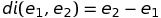
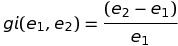
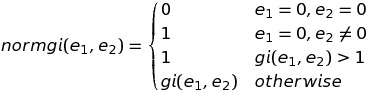
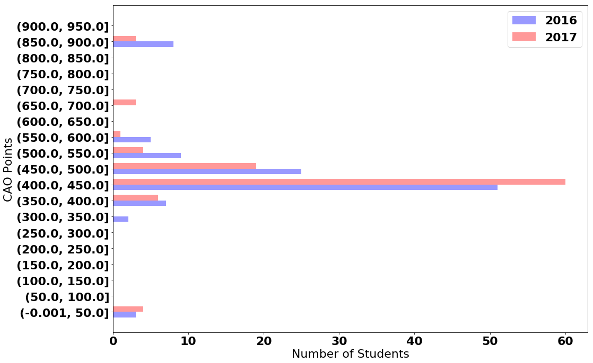
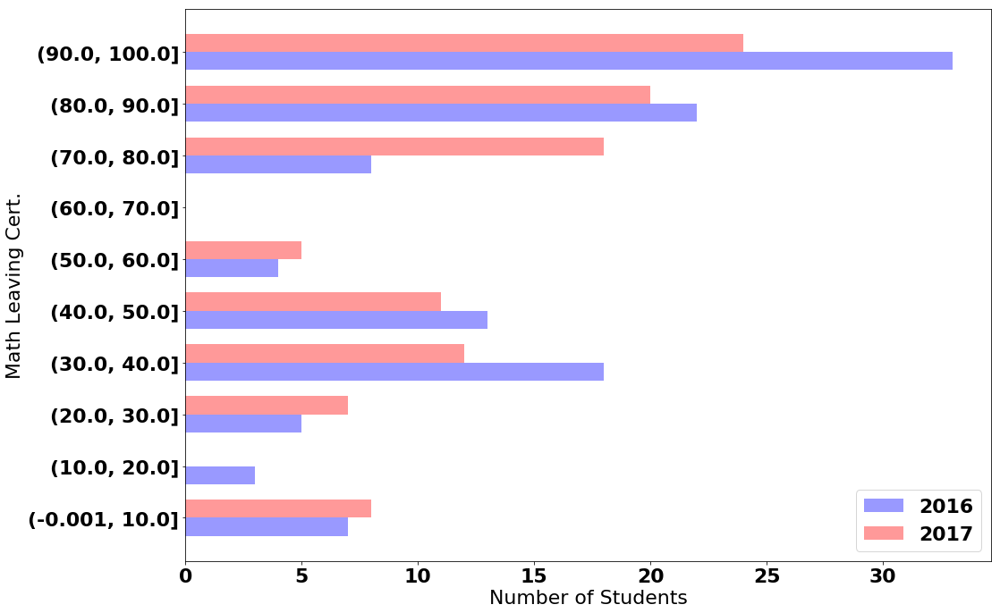
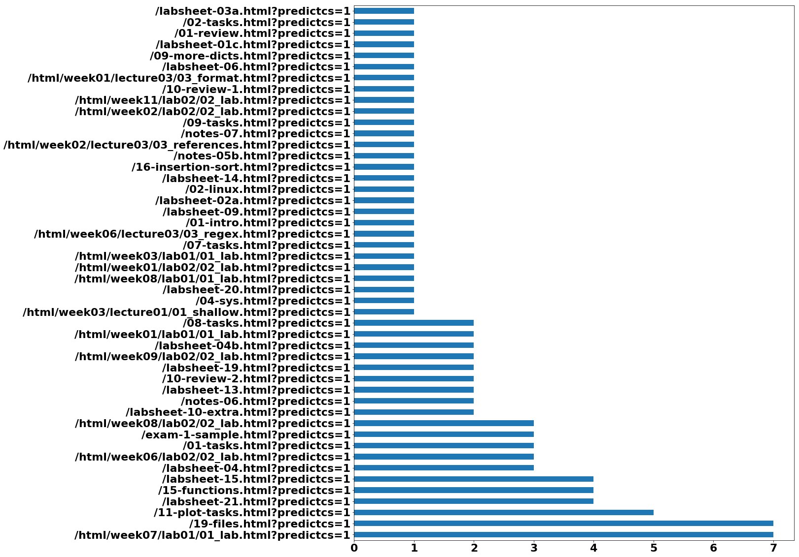
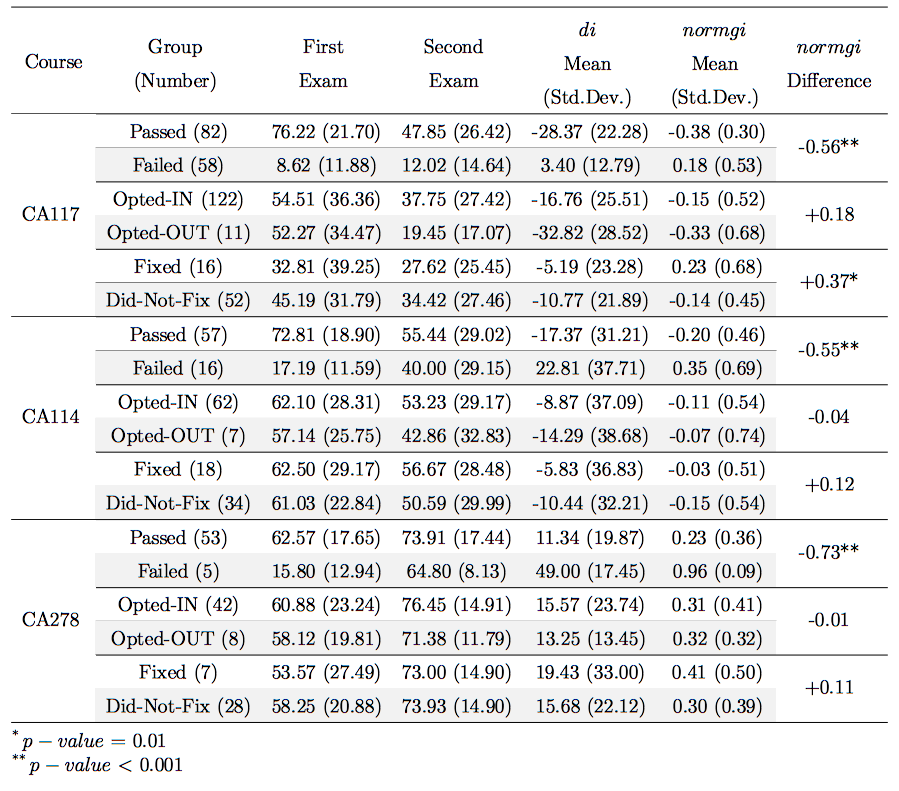

# Engagement Study on an Educational Data Mining Project

This repo builds on the work developed in [here](https://github.com/dazcona/edm-modeling) where we work on models to distinguish higher-performing students to lower performers. Students that are struggling with the material may or may not have the same issues. In order to personalize the way our students learn programming skills and support adaptive feedback in the computer programming modules, we started sending customized weekly notifications via email. This work presents a study on students' engagement and dive into the personalized weekly performance notifications. Overall, the predictive and personalised feedback helped to reduce the gap between the lower and higher-performing students. Furthermore, students praised the prediction and the personalised feedback, conveying strong recommendations for future students to use the system. We also found that students who followed their personalised guidance and recommendations performed better in examinations.

Please consider citing the following if you use any of the work:
```
@inproceedings{azcona2018exploratory,
  title={An Exploratory Study on Student Engagement with Adaptive Notifications in Programming Courses},
  author={Azcona, David and Hsiao, I-Han and Smeaton, Alan},
  booktitle={European Conference on Technology Enhanced Learning},
  pages={644--647},
  year={2018},
  organization={Springer}
}
```

## Technologies

* Python
* [numpy](https://www.numpy.org/)
* [scipy](https://www.scipy.org/)
* [Pandas](https://pandas.pydata.org/)
* [Matplotlib](https://matplotlib.org/)
* [scikit-learn](https://scikit-learn.org/)
* [Jupyter](https://jupyter.org/)

## Code

1. Exploratory Data Analysis:
   * [Exploring students' characteristics and prior info](src/EDA.%20Exploring%20students%20characteristics%20and%20prior%20info.ipynb)
   * [Exploring students' web events](src/EDA.%20Exploring%20web%20events.ipynb)
2. Measuring Engagement:
   * [Baseline](src/Engagement.%20Baseline.ipynb): 2015/2016 academic year
   * [Engagement with the suggested programming solutions](src/Engagement.%20Fixing%20Programs.ipynb): Do students in 2016/2017 academic year fix their programs and, if they do, do they perform better?
   * [Engagement with the suggested material](src/Engagement.%20Clicking%20on%20material.ipynb): Do students in 2017/2018 academic year click on the recommended material within their notifications and, if they do, do they perform better? 
   * [Engagement with a ChatBot](src/Engagement.%20Talking%20to%20the%20Virtual%20Assistant.ipynb): Do students in 2018/2019 academic year talk to the new way of feedback (a WhatsApp ChatBot) and, if they do, do they perform better? 

You can always view a notebook using https://nbviewer.jupyter.org/

## Deployment

### Virtual Environment using Bash

1. Creation of a virtual environments done by executing the command venv
2. Command to activate virtual environment
3. Install dependencies
4. List the libraries installed on your environment
5. Do your work!
6. When you are done, the command to deactivate virtual environment
```
$ python3 -m venv env/
$ source env/bin/activate
(env) $ pip install -r requirements.txt
(env) $ pip freeze
(env) $ jupyter notebook
(env) $ ...
(env) $ deactivate
```

## Equations

A difference index measures the difference between the second examination's grade and their first one for a particular student.



Then, a gain index is developed to measure the student's improvement between two examinations:



And it is normalized to output values between -1 and 1 on



## Figures

**Exploring CAO Points for CA116: 2016 vs 2017**


**Exploring Math Leaving Cert Examfor CA116: 2016 vs 2017**


**Frequency of Access to the Material and Labsheets from the Notifications:**


**Difference and Normalized Gain Index between the examinations for CA117, CA114 and CA278 on 2016/2017 academic year:**


**Difference and Normalized Gain Index between the examinations for CA117, CA114 and CA278 on 2017/2018 academic year:**

